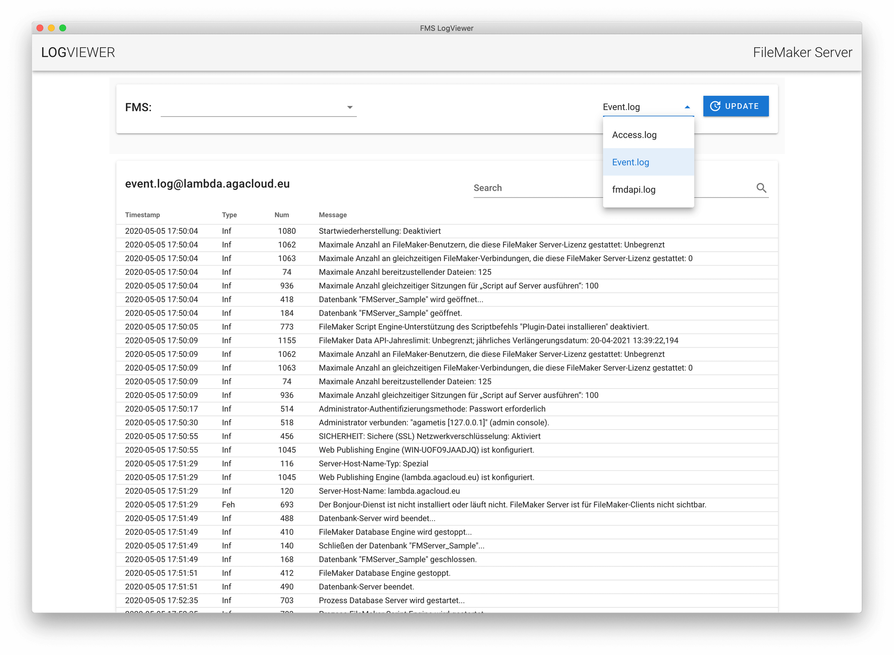

# fms-logviewer-frontend

## Table of Contents

- [About the Project](#about-the-project)
- [Prerequirements](#prerequirements)
- [Instructions](#instructions)
  - [Setup](#setup)
  - [Additional Info](#additional-info)
- [License](#license)
- [Contact](#contact)
- [Anleitung](#anleitung)
  - [Inbetriebnahme](#inbetriebnahme)
  - [Allgemeine Infos](#allgemeine-infos)

## About the Project

The Project is the frontend for the FileMaker Server LogViewer.

Since FileMaker Server 17 there is no convenient way for reading the log files. This project helps to overcome this circumstance.



## Prerequirements

Node.js >= 12.x

## Instructions

### Setup

1. Download project as zip-file from here and unpack locally
2. In the file "LogTabelle.vue" adjust the variable "serverAddressen". This variable lists all servers on which the package fms-logviewer-backend is running. (For example: fms.my-domain.com)
3. In the terminal, the following commands are executed in the project directory

- Install all dependencies with

```bash
npm install
```

- Optional: with the following command you can test the frontend or use it locally

```bash
npm run start
```

- With the following command the project is compiled for use with any web server. The content of the subdirectory "dist" must be uploaded to your web server

```bash
npm run build
```

### Additional Info

- Normally the frontend communicates with the backend on port 3050. In case the backend cannot used this port, the appropriate port in the file "LogTabelle.vue" must be defined

## License

Distributed under the MIT License. See `LICENSE` for more information.

## Contact

Adam Augustin - [@agametis](https://twitter.com/agametis) - mail.github@agametis.de

Project Link: [https://github.com/agametis/fms-logviewer-frontend](https://github.com/agametis/fms-logviewer-frontend)

## Anleitung

### Inbetriebnahme

1. Projekt als Zip-Datei von hier herunterladen und lokal entpaken
2. In der Datei "LogTabelle.vue" die Variable "serverAdressen" anpassen. In dieser Variablen werden alle Server aufgeführt, auf denen das Paket fms-logviewer-backend läuft. (Zum Beispiel: fms.meine-domain.de)
3. Im Terminal werden im Projektverzeichnis folgende Befehle ausgeführt

- Mit dem folgenden Befehl alle Abhängigkeiten installieren

```bash
npm install
```

Optional: mit dem folgenden Befehl kann das Frontend getestet oder auch direkt lokal genutzt werden

```bash
npm run start
```

- Mit dem folgenden Befehl wird das Projekt für den Einsatz auf einem beliebigen Webserver kompiliert. Der Inhalt des Unterverzeichnisses "dist" wird auf den Webserver hochgeladen

```bash
npm run build
```

### Allgemeine Infos

- Normalerweise kommuniziert das Frontend mit dem Backend auf Port 3050. Wenn aber das Backend auf diesem Port nicht genutzt werden kann, muss der passende Port in der Datei "LogTabelle.vue" angepasst werden
